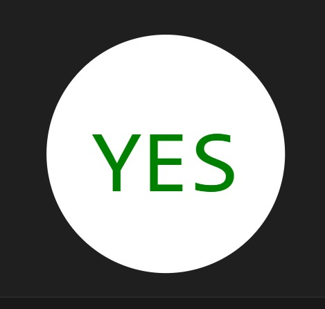
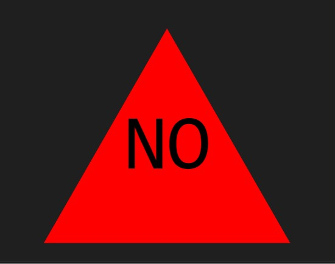
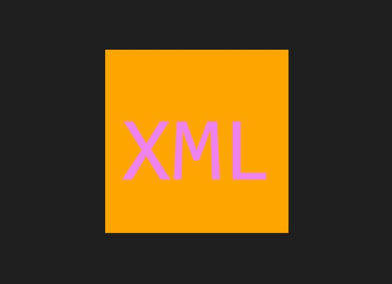

# Generate-Logo

## Description

This project is designed to use the command line interface to accept corresponding user input to generate Scalable Vector Graphics(SVG). The vector image format allows for 2D images to be easily incorporated into webpages and animations.

## Table of Contents

- [Installation](#installation)
- [Usage](#usage)
- [Credits](#credits)
- [License](#license)

## Installation

Node.js is necessary to run this program. Clone this repository and install the dependecies using npm install. To run the program use node index. This Visual Studio Code extension is helpful for viewing logo.svg <https://marketplace.visualstudio.com/items?itemName=jock.svg>.

## Usage

A walkthrough video is available here: <https://drive.google.com/file/d/1WjLRmYlnrdiSkNC741CqMIdi1lXyfjMi/view>

The example folder contains vectored files that can be previewed in the code the editor with Jock SVG extension enabled.

Sample screenshots of logo.svg:

## Credits
I used the W3Schools webpage to research vector pecifications and hexidecimal color code index.
<https://www.w3schools.com/colors/colors_hexadecimal.asp>
I had some help with figuring out the hexidecimal representation and validation from Ryan Spath <https://github.com/CodeByDex> and Zach Mutch<https://github.com/that-devguy?tab=repositories>.

## License

MIT License

Copyright (c) [2023] [Catherine-Sinkowski]

Permission is hereby granted, free of charge, to any person obtaining a copy
of this software and associated documentation files (the "Software"), to deal
in the Software without restriction, including without limitation the rights
to use, copy, modify, merge, publish, distribute, sublicense, and/or sell
copies of the Software, and to permit persons to whom the Software is
furnished to do so, subject to the following conditions:

The above copyright notice and this permission notice shall be included in all
copies or substantial portions of the Software.

THE SOFTWARE IS PROVIDED "AS IS", WITHOUT WARRANTY OF ANY KIND, EXPRESS OR
IMPLIED, INCLUDING BUT NOT LIMITED TO THE WARRANTIES OF MERCHANTABILITY,
FITNESS FOR A PARTICULAR PURPOSE AND NONINFRINGEMENT. IN NO EVENT SHALL THE
AUTHORS OR COPYRIGHT HOLDERS BE LIABLE FOR ANY CLAIM, DAMAGES OR OTHER
LIABILITY, WHETHER IN AN ACTION OF CONTRACT, TORT OR OTHERWISE, ARISING FROM,
OUT OF OR IN CONNECTION WITH THE SOFTWARE OR THE USE OR OTHER DEALINGS IN THE
SOFTWARE.

## Tests
 Tests for Jest coming soon!
